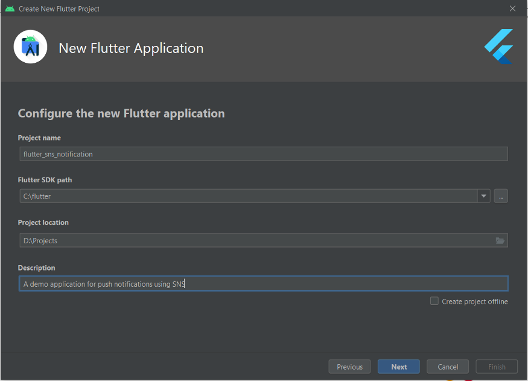

Welcome everyone, in this article we will be implementing the Flutter push notifications using the AWS Simple Notification Services (SNS). We will be using Firebase Cloud Messaging as the Service Provider for the Messaging.

## Creating a Flutter Project:
Firstly we will create a new project and I will name it flutter_aws_notification.

You can give any name to your package. Ensure that you remember it because we will need it while registering our app on Google Firebase.

## Creating a Firebase Project:
Now, once the Flutter app is created, let's go to the Google Firebase. You should have a Google Firebase account for application registration. Let's create a new project in your firebase account.

For steps 2 and 3 in the Firebase click on Next and let it be on default. After the application is registered we will be redirected to the home page of the project.

Now click on the Android logo on the home page of the project. We will be registering the android app firstly.

In the Android Package name enter the same name you entered while creating the flutter application. After that click on the Register button, which will register our flutter application on the firebase.

## Connecting the Firebase Project And Flutter Application
After registering we will be given a google-services.json file to download. Download the file and it should be saved our Flutter application, in the following path: `android / app / google-services.json`

Now we have to configure our flutter application to connect to our google firebase. In the android/app/src/build.gradle file, add the below line of code just after apply from: `$flutterRoot/packages/flutter_tools/gradle/flutter.gradle`
