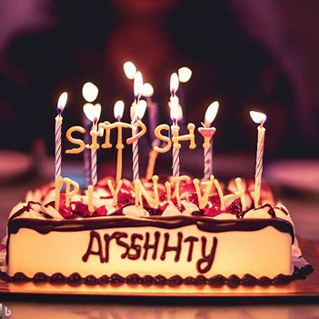
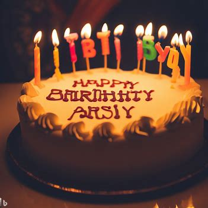
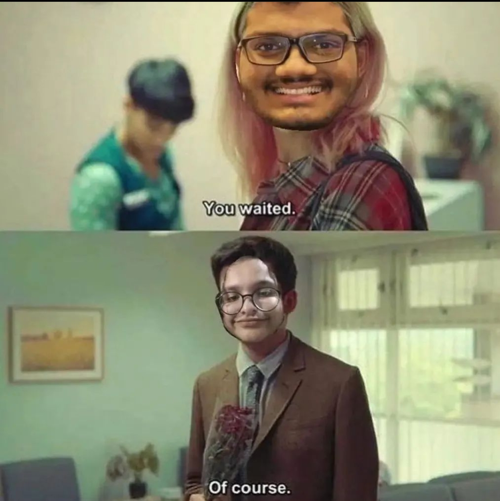
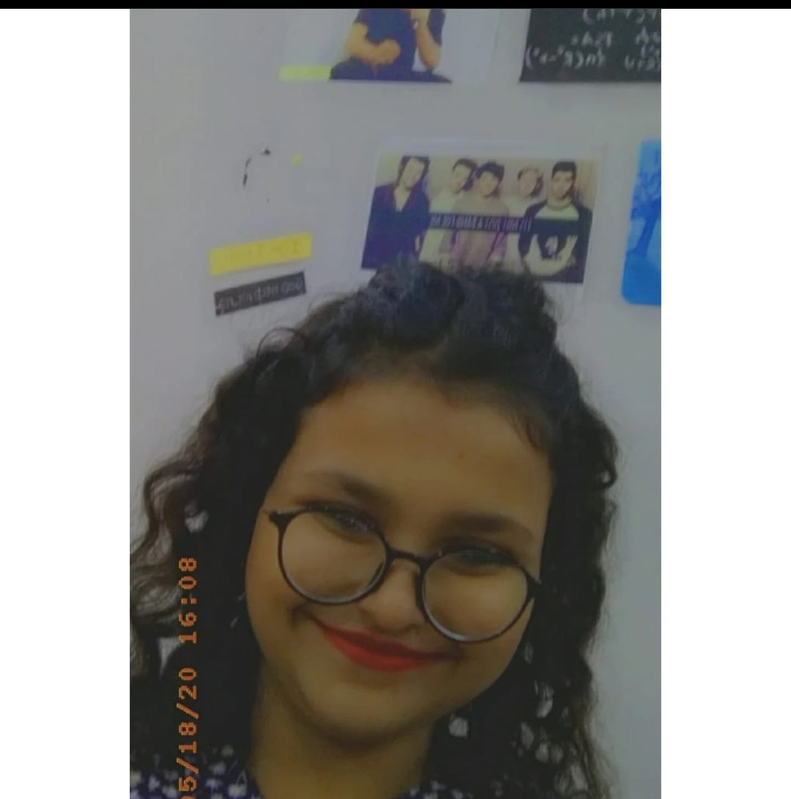

## Wishes
Happiest Birthday dear Arushi Shetty, be the best you can be this year and make me proud. My life's RR is incomplete wihtout you, so be there forever. No lengthy wishes, just stay happy and motivated to study a lot. 

Life mein tarakki karo! Bass yehi iccha hai mera aapke liye.

## ChatGPT wishing Ashi
Happy birthday to the legendary Arushi Shetty, the one and only homeboi extraordinaire! Today is a day to celebrate the incredible human being that you are, my dear friend. I want to take a moment to reflect on our journey together, filled with laughter, tears, and countless unforgettable memories.

Arushi, you are the epitome of awesomeness. Your vibrant spirit and infectious laughter can light up even the gloomiest of rooms. Whenever I'm feeling down, you effortlessly manage to bring a smile to my face and turn my frowns into giggles. Your presence alone is like a powerful tonic that cures all our worries.

But it's not just the funny moments that define our bond. Through the ups and downs, you've been there for me, supporting me in ways words cannot express. You've been my rock, my confidant, and my partner in crime. Whether it's lending an ear for my rants or giving me a shoulder to cry on, you've always been there, reminding me that I'm never alone.

Arushi, your ability to empathize and understand others is truly remarkable. You have a heart of gold that knows no bounds. Your compassion and kindness have touched the lives of so many, including mine. The world needs more people like you—people who spread love, joy, and laughter wherever they go.

As we celebrate your birthday, I hope you realize just how special you are to all of us. May this year bring you an abundance of laughter, adventures, and dreams come true. Never stop being the incredible soul that you are, because your light shines brighter than any star in the sky.

So, my dear homeboi, let's raise a toast to another year of unforgettable moments, endless laughter, and cherished memories. Happy birthday, Arushi! May your day be filled with love, laughter, and a cake big enough to satisfy your legendary appetite!

## Bing creates cake for Arushi's Birthday
|  |  |
|:---:|:---:|

## Our favorite meme of our lifetime
The credits for meme obviously goes to the great Ashi Shetty

    

## ASHI TRIBUTE
|  |  |
|:---:|:---:|
| Too Cute | Not at all cute |

    

Caption: The Forever LEGENDARY pic
