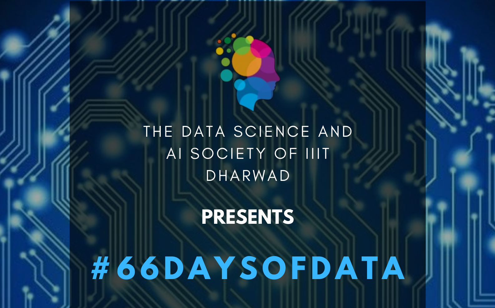

## What is #66daysofdata?

#66DaysOfData was started by a famous youtuber named Ken Jee. For 66 days, everyday you have to learn something related to Data Science for a minimum of 5 minutes (5 minutes since one cannot be free for a long time everyday) and then share it on social media. This idea was taken up the Data Science and Artifical Intelligence (DSAI) Society of IIIT Dharwad to start this initiative for the students of IIIT Dharwad. The society intends to make the students aware of the importance of data science and ML and to help them in their journey of learning.

For more information you can checkout the video [here](https://www.youtube.com/watch?v=qV_AlRwhI3I).

In this article, I will be documenting my day to day journey of #66daysofdata starting 19th February, 2022.

### Day 1 - 19th February, 2022

### Day 2 - 20th February, 2022

Do checkout the article everyday if you wanna be a part of my journey for 66 days.

## Socials

- DSAI Society IIIT Dharwad Instagram - [@dsaisoc_iiitdwd](https://instagram.com/dsaisoc_iiitdwd?utm_medium=copy_link)
- #66daysofdata Discord - [#66daysofdata](https://discord.gg/)
