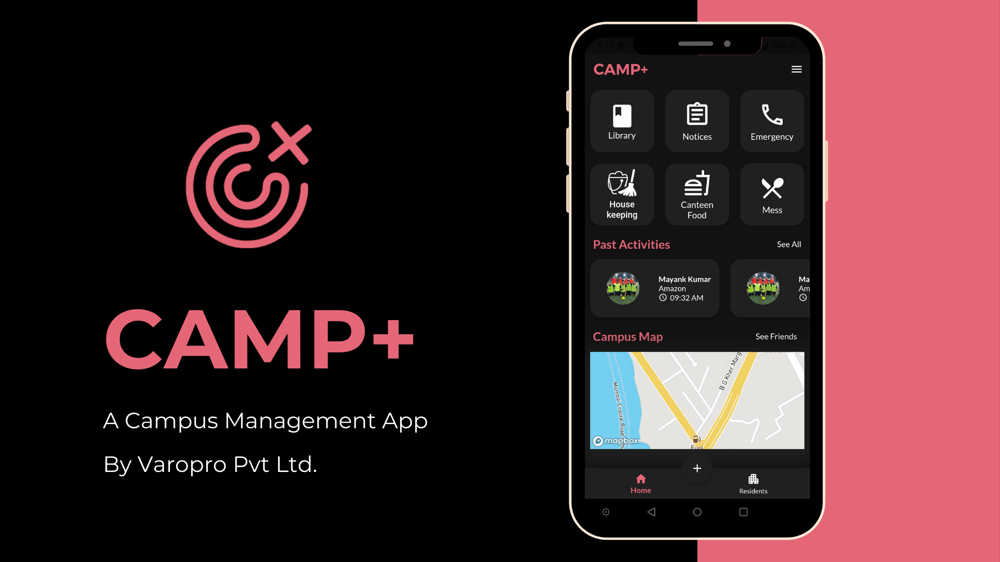

Hello Everyone, these are few of the many projects i have built. 

## Camp+

The application Camp+ which is built in Flutter and NodeJS manages deliveries, visitors to the campus, helps the residents of the hostel in viewing and calling other residents of different hostels, allows booking housekeeping facilities and solves several other essential needs relevant to residential campuses like library booking, notice board management, cafeteria slot management, event booking management, room booking management, laundromat slot booking, canteen delivery system  and so on. 
I worked in the backend which included working with NodeJS in compliance with the MVC module structure for developing various modules for the features. AWS services like S3 and DynamoDB and also MongoDB were used for data storage. For more information please check out the [Camp+](https://camplus.network/) website.

## Chitran
The “Chitran” platform allows the user to view the various crime data segregated in a very structured manner. As a part of this work, I facilitated the automation of cleaning huge chunks of data provided in the National Crime Records Bureau (NCRB), GoI website. Furthermore, after the cleaning I had to label encode the data for converting them into the machine readable form. Eventually after the preprocessing of the data it was time to visualize the data into various charts which are very easy to understand.

## Sarathi (Safe Zone Detection for UAV)
I worked on the safety and backup mechanisms of the Unmanned Aerial Vehicles (UAV) in case of crash landings, loss of connection, system failure, loss of control etc. The system uses compression and sensing techniques to detect a safe zone using HD cameras fitted onto the UAVs. Compressed Sensing will benefit us in saving Power, low size of the processed image and efficient use of Bandwidth for communication. The system explores different Gabor orientations based on the fact that the degree of Gabor orientation responses is high for variations and low for smooth/flat regions in images which help us in detecting flat regions for safe landing of UAV. The system performs histogram operations for Gabor response images to classify pixels which contribute to homogeneous regions and it results in candidate pixel detection. The system introduces a Markov Chain Code sharing the same probability based values grouping neighbouring pixels. It finds the largest candidate region from a varying range corresponding to their respective Gabor response images and then compares the areas of other candidate regions to eliminate noise and small regions, which results in reference candidate regions. Furthermore, the system uses Chi-Square Techniques. It finds the most similar candidate region among all the other corresponding regions, and then it performs a union operation for fusing the reference candidate region and the most alike one, which denotes flat safe regions for UAV landing. To identify a safe zone for landing, existing image processing-based systems focus on segmentation of regions of interest (zone detection), such as greenery, forest, river and mountain. Then the systems classify the segmented regions such as a river, mountain, greenery, forest and road to find safe and flat zones; this can be considered as zone verification for the detected zones.

## Tera&Tech (ML-based house predictor)
It is a Machine Learning based house predictor for the people who buy houses taking a Home Loan.

## Covid Tracker

Tracks the information regarding the Covid-19 essential for a student to know before he or she finds a job in the affected places.

For more information about the project and the code you can check out the [Github](https://github.com/koolgax99/Covid-19-Tracker)